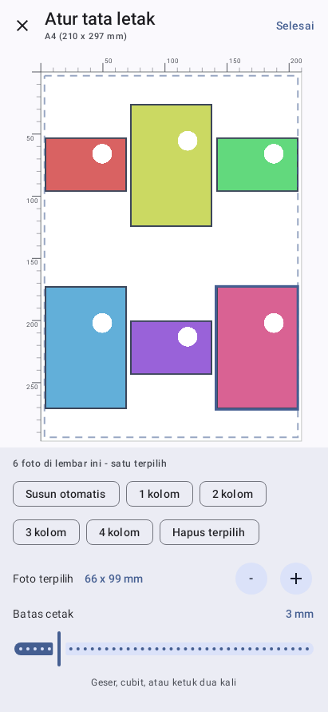
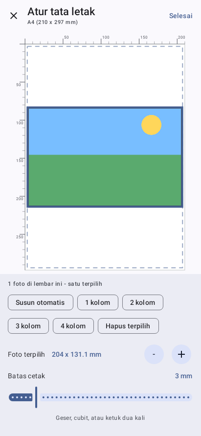
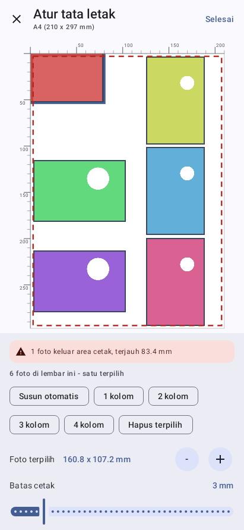

# Printigo — cetak ke Epson L3110 dari Android

Aplikasi Android untuk mencetak **gambar dan PDF** langsung ke Epson L3110 lewat
kabel USB (USB-C di HP → USB-B di printer). Tanpa WiFi, tanpa komputer, tanpa
server cetak.

<p align="center">
  
  
  
</p>

---

## Kenapa harus dibuat sendiri

L3110 hanya punya port USB, dan dia **tidak mengerti PDF, PostScript, maupun
PCL**. Satu-satunya bahasa yang dia pahami adalah **ESC/P-R**, format raster
milik Epson. Jadi tidak ada jalan pintas berupa "kirim berkas PDF ke printer".
Alurnya harus:

```
Gambar / PDF  →  render jadi bitmap  →  encode ESC/P-R  →  USB bulk endpoint
```

Ketiga tahap itulah isi aplikasi ini.

---

## Status: apa yang terbukti, apa yang belum

Ini bagian terpenting dari README ini. Aplikasi ini dibangun tanpa akses ke HP
untuk mengujinya, jadi batas antara "terbukti" dan "belum" dijaga ketat.

### Sudah terbukti

| Pemeriksaan | Cara |
|---|---|
| **Halaman uji tercetak benar di Epson L3110 sungguhan** | `tools/testpage_light.py` dikirim apa adanya lewat `tools/send_raw.ps1` (winspool, datatype RAW, tanpa melewati driver Epson) |
| Printer memang keluarga ESC/P-R | Registry Windows melaporkan compatible ID `1284_CID_EpsonRGB` |
| Panjang tiap perintah cocok dengan driver resmi Epson | `setj`=22, `setq`=9, `endp`=1, `sttp`/`endj`=0 byte data |
| Encoder Kotlin dan encoder Python identik **byte per byte** | SHA-256 sama untuk halaman uji yang sama |
| RLE bolak-balik utuh, termasuk batas penghitung 128/129 | 11 pola data |
| Pratinjau dan raster memakai penempatan yang sama | seluruh kombinasi kertas × dpi × margin |
| Layar utama dan editor tata letak tersusun dan bisa disentuh | Robolectric, 17 uji |
| Susunan banyak foto: kisi, geser, ukur, pilih, potong | 16 uji lembar |
| ViewModel bisa dibuat lewat factory bawaan seperti `by viewModels()` | 2 uji |
| Ukuran kertas di editor tidak berubah saat isi kontrol berubah | 3 uji stabilitas |
| Penempatan manual, pemotongan, dan pembatas geseran | 15 uji tata letak |
| Tampilan benar-benar tergambar | tangkapan layar dari komposisi Compose di JVM |
| APK terkompilasi, tertandatangani, zipalign, manifes benar | `apksigner`, `zipalign`, `aapt2` |

**78 unit test**, semuanya lolos: `gradlew test`.

### Belum terbukti

**Lapisan transport USB di Android** (`usb/UsbPrinter.kt`) — penemuan perangkat,
dialog izin USB, dan bulk transfer. Pengujian di atas menempuh jalur Windows →
spooler → port USB, bukan jalur OTG dari HP.

Jadi yang terbukti adalah **datanya**, bukan **pengantarannya**.

**Perilaku terhadap bilah sistem.** Robolectric tidak mengantarkan window inset
ke Compose: inset yang dikirim terbaca nol, sehingga uji apa pun tentang jarak
ke bilah navigasi akan lolos baik perbaikannya ada maupun tidak. Karena uji yang
lolos di kedua keadaan lebih menyesatkan daripada tidak ada uji, bagian ini
sengaja tidak diuji dan hanya bisa diperiksa di perangkat.

---

## Memasang

Bangun APK-nya (lihat [Membangun sendiri](#membangun-sendiri)), salin ke HP,
buka, lalu izinkan "Install unknown apps" untuk aplikasi tempat Anda membukanya.

> **Kalau pemasangan menggantung di "Installing…"**, kemungkinan besar ada versi
> lama yang tanda tangannya berbeda. Hapus dulu lewat **Settings → Apps → Printigo
> → Uninstall**, baru pasang lagi. Antar-APK yang ditandatangani kunci yang
> sama, pembaruan berjalan normal karena `versionCode` ikut naik.

### Yang dibutuhkan

- HP Android 7.0+ yang mendukung **USB OTG / USB Host**. Ini syarat mutlak dan
  tidak semua HP punya. Aplikasi akan memberi tahu kalau HP Anda tidak mendukung.
- Kabel **USB-C ke USB-B**, atau adaptor OTG USB-C→USB-A ditambah kabel printer
  USB-A→USB-B biasa.
- Printer tetap harus tercolok listrik; dia tidak mengambil daya dari HP.

---

## Cara pakai

1. Colok printer ke HP, nyalakan printer.
2. Buka aplikasi. Panel paling atas menuntun langkah demi langkah: HP mendukung
   OTG → printer terdeteksi → izin USB → siap. Hanya satu tombol yang muncul
   sekaligus, jadi tidak perlu menebak harus menekan apa.
3. **Pilih berkas** (gambar atau PDF). Pratinjau langsung muncul.
4. Atur kertas, margin, resolusi. Pratinjau ikut berubah seketika.
5. Kalau perlu, ketuk pratinjau atau tekan **Atur tata letak** untuk membuka
   editor layar penuh: **geser** untuk memindahkan, **cubit** untuk
   memperbesar, **ketuk dua kali** untuk mengembalikan. Ada juga tombol
   perbesar/perkecil bertahap dan penggeser batas cetak. Penggaris milimeter
   di tepi membantu menempatkan dengan tepat, dan bagian yang keluar area
   cetak diwarnai merah beserta peringatan berapa milimeter yang terpotong.
6. Tekan **Cetak**.

Bisa juga membagikan (Share) gambar atau PDF dari aplikasi lain ke aplikasi ini.

Tombol **Simpan .prn** menulis pekerjaan cetak ke berkas alih-alih ke printer.
Berguna untuk memisahkan masalah data dari masalah kabel.

---

## Fitur

- Cetak **gambar** (JPEG/PNG/WebP, rotasi EXIF dihormati) dan **PDF** banyak halaman
- **Banyak foto dalam satu lembar**: tambahkan sekaligus, susun otomatis ke
  kisi 1-4 kolom, atau atur sendiri posisi dan ukuran tiap foto
- Sentuh sebuah foto untuk memilihnya; geser dan cubit hanya mengenai yang
  terpilih, dan yang dipilih naik ke tumpukan paling atas
- **Editor tata letak layar penuh**: geser untuk memindahkan, cubit untuk
  memperbesar, ketuk dua kali untuk mengembalikan ke ukuran muat, plus tombol
  perbesar/perkecil bertahap untuk menyetel beberapa persen
- **Penggaris milimeter** di tepi atas dan kiri kertas
- Ukuran isi ditampilkan dalam milimeter, bukan persentase, supaya bisa
  langsung dicocokkan dengan penggaris sungguhan
- **Peringatan terpotong**: bagian yang keluar area cetak diwarnai merah, dan
  jaraknya disebutkan per sisi dalam milimeter
- Pembacaan margin sesungguhnya per sisi, ikut berubah saat digeser
- Ukuran kertas: A4, Letter, Legal/F4, A5, A6, B5, 4R, kartu pos
- Margin 0–20 mm dengan slider
- Resolusi 300 / 360 / 600 / 720 dpi
- Kualitas draft / normal / tinggi, berwarna atau hitam putih
- Jenis media: kertas biasa, matte, kertas foto, foto glossy
- Salinan 1–20
- **Daftar periksa sambungan** yang menuntun sampai siap cetak
- **Pesan kegagalan berbahasa manusia** dengan satu tombol tindakan
- Pemeriksaan dukungan ESC/P-R lewat IEEE-1284 Device ID
- Ekspor `.prn` untuk diagnosis

---

## Cara kerjanya

```
app/src/main/java/com/escpr/usbprint/
  layout/PageLayout.kt       penempatan satu isi di kertas, dalam milimeter
  layout/Sheet.kt            banyak foto dalam satu lembar: kisi, geser, ukur
  render/SheetPageSource.kt  merender lembar berisi banyak foto
  ui/LayoutEditorDialog.kt   editor tata letak layar penuh
  escpr/EscpR.kt             perintah ESC/P-R tingkat byte + enum pengaturan
  escpr/Rle.kt               kompresi run-length per piksel
  escpr/EscpRJob.kt          perakit job: start -> halaman -> baris -> selesai
  usb/UsbPrinter.kt          penemuan perangkat, klaim antarmuka, bulk transfer,
                             pembacaan Device ID, sink berbuffer
  usb/PrinterError.kt        sebab kegagalan bertipe
  render/PageSource.kt       render PDF dan gambar per pita (band)
  render/PreviewRenderer.kt  render isi dokumen untuk pratinjau
  print/PrintTask.kt         penyatu: pita -> baris RGB -> perintah dsnd
  ui/                        ViewModel dan tampilan Compose
```

### Kenapa dirender per pita

Halaman A4 pada 720 dpi berukuran sekitar 5783 × 8249 piksel. Kalau di-render
sekaligus butuh sekitar 190 MB dan aplikasi pasti mati kehabisan memori. Karena
itu halaman digambar sepotong demi sepotong setinggi ±128 baris, langsung diubah
jadi perintah `dsnd`, lalu dibuang. Pemakaian memori jadi tetap sekitar 4 MB
berapa pun resolusinya.

### Kenapa RLE penting

Tanpa kompresi, satu halaman A4 360 dpi berukuran 37 MB dan pengirimannya lama
sekali lewat USB. Dengan RLE, halaman uji yang sama jadi 1,9 MB, dan dokumen
teks biasa bisa menyusut lebih dari 50 kali.

### Kenapa pratinjaunya bisa realtime

Isi dokumen dirender **sekali** pada rasio aslinya oleh `PreviewRenderer.kt`.
Penempatan kertas, margin, geseran, dan perbesaran cuma aritmetika yang
dihitung ulang tiap frame di `layout/PageLayout.kt`. Jadi menggeser jari tidak
pernah memicu render ulang dokumen.

### Kenapa lembar dan dokumen dipisah

Gambar disusun sebagai **lembar**: sekumpulan foto yang masing-masing punya
kotak sendiri dalam milimeter. PDF tetap lewat jalur **dokumen**, karena tiap
halamannya punya ukuran sendiri dan tidak masuk akal ditumpuk bersama foto lain.

Untuk satu isi per kertas, "sebesar mungkin di dalam area cetak" adalah acuan
yang masuk akal, dan itulah yang disimpan `ContentPlacement`. Begitu ada banyak
foto, acuan itu hilang dan yang tersisa hanyalah posisi sesungguhnya di kertas
-- karena itu `SheetItem` menyimpan kotak milimeter apa adanya.

Jalur cetak tidak perlu tahu bedanya. `SheetPageSource` melaporkan rasio yang
sama dengan rasio area cetak, sehingga kotak tujuannya persis seluas area cetak,
lalu ia menempatkan tiap foto di dalamnya sendiri.

### Kenapa dispatcher-nya bisa disuntik

`PrintViewModel` menerima dispatcher untuk kerja berat dan untuk penerbitan
state. Menulis state yang diamati Compose dari utas latar bisa memicu tata letak
ulang di utas yang salah, jadi penerbitannya selalu di utas utama. Pengujian
menyuntikkan dispatcher langsung sehingga semuanya berjalan tanpa bergantung
pada penjadwalan utas -- itu menghapus satu kelas kerapuhan yang sebelumnya
muncul berulang.

### Kenapa kertas dan kontrol dibagi menurut bobot tetap

Kertas di editor tidak mengambil "sisa ruang" setelah bilah kontrol, melainkan
porsi tetap dari tinggi layar. Alasannya bukan estetika: bilah kontrol berubah
tinggi ketika peringatan terpotong muncul atau baris margin melipat jadi dua.
Kalau kertas mengambil sisanya, ia ikut menyusut -- gambar melompat saat digeser,
dan yang lebih parah, skala kertas berubah di tengah gestur.

Isi kontrol yang tidak muat digulir, bukan mendorong kertas mengecil.

`PagePreview` juga tidak lagi memakai skala dan posisi kertas sebagai kunci
`pointerInput`. Nilai-nilai itu berubah setiap kertas berganti ukuran, dan
mengubah kunci `pointerInput` akan merestart detektor gestur sehingga sentuhan
yang sedang berjalan terputus. Sekarang nilainya dibaca lewat
`rememberUpdatedState` dari blok gestur yang stabil.

### Kenapa editornya layar penuh

Mengatur posisi dan ukuran dengan jari butuh kertas sebesar mungkin. Di kartu
setinggi 300 dp, penggaris milimeter tidak terbaca dan geseran satu milimeter
tidak terlihat bedanya. Selain itu gestur di dalam halaman yang bisa digulir
akan berebut sentuhan dengan gulirannya.

Karena itu pratinjau di halaman utama sengaja tidak bisa diatur -- ia hanya
menampilkan hasil dan membuka editor saat diketuk.

### Kenapa pratinjau dan hasil cetak tidak mungkin berbeda

Keduanya memanggil fungsi yang sama, `computePageLayout`, dan hasilnya dalam
**milimeter** — bukan piksel layar maupun piksel printer. Pratinjau mengalikan
milimeter itu dengan skala layar; jalur cetak mengalikannya dengan dpi. Tidak
ada rumus penempatan kedua yang bisa menyimpang.

Penempatan pengguna disimpan relatif terhadap ukuran "muat", bukan absolut,
sehingga tetap masuk akal ketika kertas atau resolusi diganti.

Pemotongan pun tidak diprogram khusus: kotak tujuan boleh bernilai negatif atau
melebihi lebar area cetak, dan bagian yang di luar bitmap pita memang tidak
pernah tergambar. Peringatan di layar menghitung selisih yang sama.

Kesetaraan itu **diuji, bukan sekadar diklaim** — lihat `PageLayoutTest`, yang
mencocokkan area cetak model milimeter dengan geometri raster
`EscpRJob.computeGeometry` untuk seluruh kombinasi kertas, dpi, dan margin.

### Kenapa sebab kegagalan dibuat bertipe

Semua `throw` di `UsbPrinter` membawa `PrinterErrorKind`, bukan sekadar pesan
teks. Pesan untuk pengguna bisa berubah kapan saja tanpa mengacaukan cara
aplikasi memilih tindakan pemulihan.

Satu hal tidak bisa ditentukan dari jenis pengecualian saja: transfer gagal bisa
berarti kertas habis, atau kabel tersenggol. Jadi saat gagal, aplikasi memeriksa
**apakah printer masih terdaftar di daftar perangkat USB saat itu juga** —
pemeriksaan langsung, bukan tebakan dari isi pesan.

---

## Membangun sendiri

```bash
gradlew assembleRelease    # APK rilis, tertandatangani
gradlew assembleDebug      # APK debug
gradlew test               # 78 unit test
```

Nama berkas APK memuat nomor versi (`Printigo-v1.8-release.apk`), jadi dua
build berbeda tidak pernah bernama sama. Versi yang sama juga tampil di bawah
judul aplikasi, supaya bisa disebutkan saat melaporkan masalah.

Kebutuhan: `minSdk 24` (Android 7.0), target SDK 35, Kotlin 2.0.21, AGP 8.6.1,
Gradle 8.9, JDK 17+.

`local.properties` harus menunjuk ke Android SDK Anda (`sdk.dir=...`). Android
Studio mengisinya otomatis saat proyek dibuka.

### Penandatanganan

Varian rilis membaca `keystore.properties` di akar proyek:

```properties
storeFile=../keystore/nama-kunci.jks
storePassword=...
keyAlias=...
keyPassword=...
```

Berkas itu dan seluruh isi `keystore/` **tidak ikut ke repositori** — keduanya
ada di `.gitignore`. Kalau `keystore.properties` tidak ada, varian rilis tetap
bisa dirakit, hanya saja hasilnya tidak tertandatangani dan tidak bisa dipasang.

**Simpan kunci Anda baik-baik**: Android hanya mau memasang pembaruan yang
ditandatangani kunci yang sama. Kalau kunci hilang, satu-satunya cara memperbarui
adalah menghapus dulu aplikasi yang terpasang.

Pengecilan kode R8 sengaja dimatikan sampai aplikasi terbukti jalan di HP: R8
bisa membuang sesuatu yang ternyata dipakai saat berjalan, dan rilis pertama
dibuat seidentik mungkin dengan varian yang diuji.

---

## Perkakas di `tools/`

Semuanya berdiri sendiri dan tidak butuh Android.

### Menguji printer tanpa HP

Cara tercepat memisahkan masalah data dari masalah USB. Kalau halaman uji keluar
dari printer, encoder-nya benar dan sisa masalah pasti ada di sisi Android.

```bash
python tools/testpage_light.py uji.prn --paper A4 --dpi 300
powershell -File tools/send_raw.ps1 -Printer "EPSON L3110 Series" -File uji.prn
```

`send_raw.ps1` memakai winspool dengan datatype `RAW`, jadi byte-nya sampai ke
printer persis seperti yang dihasilkan encoder — driver Epson tidak ikut
mengubahnya. Halaman ujinya hemat tinta (~3% cakupan) dan memuat penggaris
milimeter, sehingga skala dan margin bisa diperiksa dengan penggaris sungguhan.

### Encoder Python (kembaran dari yang di aplikasi)

```bash
python tools/selftest.py                                         # 30 pemeriksaan encoder
python tools/make_prn.py keluar.prn --image foto.jpg --dpi 720   # butuh Pillow
```

`tools/parity/` membandingkan keluaran encoder Kotlin dan Python byte per byte.

### Ikon aplikasi

```bash
powershell -File tools/make_icons.ps1 -Source ikon.png -ResDir app/src/main/res
```

Mengukur radius sudut dan batas artwork dari gambar, lalu menghasilkan PNG
legacy persegi dan bulat di lima kerapatan layar plus lapisan ikon adaptif.

---

## Batasan yang diketahui

- **Belum diuji di HP sungguhan.** Lihat bagian Status di atas.
- Tidak terhubung ke kerangka cetak bawaan Android, jadi tombol "Print" di
  aplikasi lain tidak memakai aplikasi ini. Pakai "Bagikan" atau buka berkasnya
  dari dalam aplikasi.
- Tidak ada rotasi 90 derajat. Dokumen lanskap bisa diperbesar dan digeser
  sendiri, tapi tidak bisa diputar agar memenuhi kertas potret.
- Tidak ada pemilihan rentang halaman PDF — selalu semua halaman.
- Tanpa borderless, tanpa dupleks (L3110 memang tidak punya), tanpa pemindai.
- Slider margin memakai satu nilai untuk keempat sisi; margin per sisi hanya
  bisa diatur dengan menggeser gambar di pratinjau.
- Penempatan berlaku sama untuk semua halaman PDF dalam satu pekerjaan cetak.
- Lembar foto selalu satu halaman; foto yang tidak muat tidak tumpah ke lembar
  berikutnya.
- Foto pada lembar tidak bisa diputar sendiri-sendiri.
- Membatalkan cetak menghentikan pengiriman, tapi halaman yang sudah terlanjur
  masuk ke printer tetap akan keluar.

---

## Riwayat versi

| Versi | Isi |
|---|---|
| **1.8** | Ukuran kertas di editor tidak lagi berubah-ubah. Sebelumnya kertas mengambil sisa ruang, jadi munculnya peringatan terpotong atau melipatnya baris margin membuat kertas menyusut, gambar melompat, dan geseran terputus di tengah jalan |
| 1.7 | Tombol Simpan .prn dan Cetak tidak lagi tertutup bilah navigasi sistem: bilah bawah kini menerima inset navigasi, begitu pula kontrol di editor tata letak |
| 1.6 | Perbaikan mati saat dibuka: konstruktor `PrintViewModel` kehilangan tanda tangan `(Application)` yang dicari factory bawaan, karena parameter dispatcher yang ditambahkan di 1.5. Ditambah uji yang membuat ViewModel lewat jalur yang sama dengan `by viewModels()` |
| 1.5 | Banyak foto dalam satu lembar: tambah sekaligus, susun otomatis 1-4 kolom, pilih dengan menyentuh, geser dan ubah ukuran per foto, hapus yang terpilih; dispatcher ViewModel bisa disuntik |
| 1.4 | Pengaturan tata letak pindah ke editor layar penuh yang dibuka dengan mengetuk pratinjau; tombol perbesar/perkecil bertahap; ukuran isi dan batas cetak bisa diatur di satu tempat |
| 1.3 | Pratinjau bisa diatur dengan jari (geser, cubit, ketuk dua kali); penggaris milimeter; peringatan bagian yang akan terpotong beserta jaraknya per sisi; penempatan dipakai bersama oleh pratinjau dan jalur cetak lewat model milimeter; judul layar jadi "USB Printer OTG" dan nama aplikasi jadi "Printigo" |
| 1.2 | Tanda tangan APK memakai skema v1 + v2 + v3 sekaligus, untuk pemasang bawaan yang masih mencari blok v1 |
| 1.1 | Panel daftar periksa sambungan di paling atas; pesan kegagalan berbahasa manusia dengan satu tombol tindakan di dekat tombol Cetak; sebab kegagalan bertipe; pembatalan tidak lagi terbaca sebagai kegagalan; nomor versi masuk ke nama berkas APK dan tampil di aplikasi |
| 1.0 | Encoder ESC/P-R (terbukti mencetak di L3110), pratinjau realtime kertas dan margin, tampilan Material 3, ikon aplikasi, transport USB OTG |

---

## Rujukan

Tata letak byte ESC/P-R disusun dari dua sumber terbuka yang saling
mengonfirmasi, lalu dicek silang terhadap panjang perintah di driver C resmi
Epson:

- [ezrec/python-epson](https://github.com/ezrec/python-epson) (MIT) — struktur
  perintah `setj`, `setq`, `dsnd`, `sttp`, `endp` beserta urutan REMOTE1
- [epson-inkjet-printer-escpr](https://github.com/mrnuke/epson-printer-escpr-improved)
  (GPL) — konstanta perintah di driver CUPS resmi Epson
